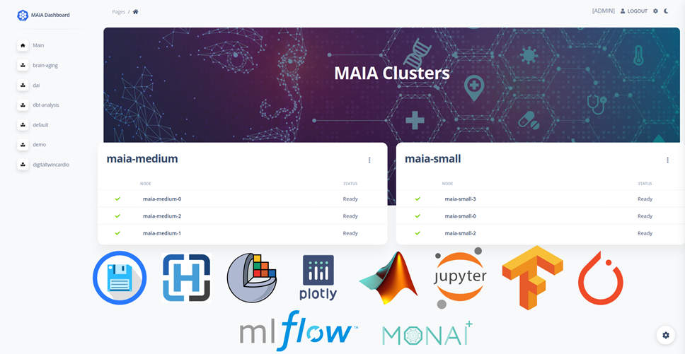

# MAIA Docs

### Welcome to MAIA Official Documentation !

Here you can find useful information on how to request and register an account, correctly authenticate and access the *MAIA* cluster.

- [User Registration](user_registration.md)
- [Getting Started](getting_started.md)
- [User Authentication](user_authentication.md)
- [Cluster Access](cluster_access.md)

You can also find information about the resources access (with port-forwarding) and about the file transfer options
between a local computer and the remote cluster.

- [Resources Access](resources_access.md)
- [File Transfer](file_transfer.md)

### Advanced Documentation for Admins
As a Cluster Admin, you can create namespaces for different GitHub Teams, populate them with the Team's user account, deploy applications and resources.

- [Deploy Resources](hive_deploy_chart.md)

## MAIA Workflow [COMING SOON]
MAIA's ultimate goal is to provide a common framework to promote and facilitate the development of AI tools in the clinical context, with a particular focus on the final deployment of such tools in a real use-case scenario.
To achieve this goal, MAIA provides a set of tools to support the entire Medical AI life-cycle development pipeline, from data preparation to model deployment.
The MAIA Workflows are a set of applications that can be used to perform the following tasks:

- **Data Preparation**: a set of tools to prepare the data for the AI model training, including Data Storage, Data Sharing, and Image Visualization.
  - Orthanc
  - File Browser
  - OHIF Viewer
  - 3D Slicer

- Data Annotation: a set of tools to annotate the data for the Supervised AI model training.
  - 3D Slicer [ + MONAI Label ]
  - Label Studio
- Model Training: a set of tools to train and monitor the AI model on the annotated data.
    - Jupyter Hub with the following frameworks available:
      - PyTorch
      - TensorFlow
      - MONAI
      - nnU-Net
      - nn-Detection
    - Matlab
    - MLFlow
- Model Evaluation: a set of tools to evaluate the trained AI model, including model performance metrics, model robustness, and model generalization capabilities.
  - MySQL
  - Honeycomb
  - Metrics Reloaded
- Model Deployment: a set of tools to deploy the trained AI model, including model conversion, model optimization, and model deployment.
  - MLFlow
  - Panel
  - Monai Bundle and Monai Deploy
- Model Refinement: a set of tools to refine the trained AI model, including model re-training, model fine-tuning, and model transfer learning.
  -  MONAI Label

## MAIA Dashboard [COMING SOON]

MAIA Dashboard is a web-based application that allows users to easily access and manage the resources deployed in the MAIA cluster.
With the Dashboard, users can easily deploy new resources, manage the existing ones, and monitor the status of the cluster.
In addition, the Dashboard provides a user-friendly interface to directly access all the MAIA Workflow applications, either by visiting the application's web page or by establishing a port forwarding connection with the application's pod.
